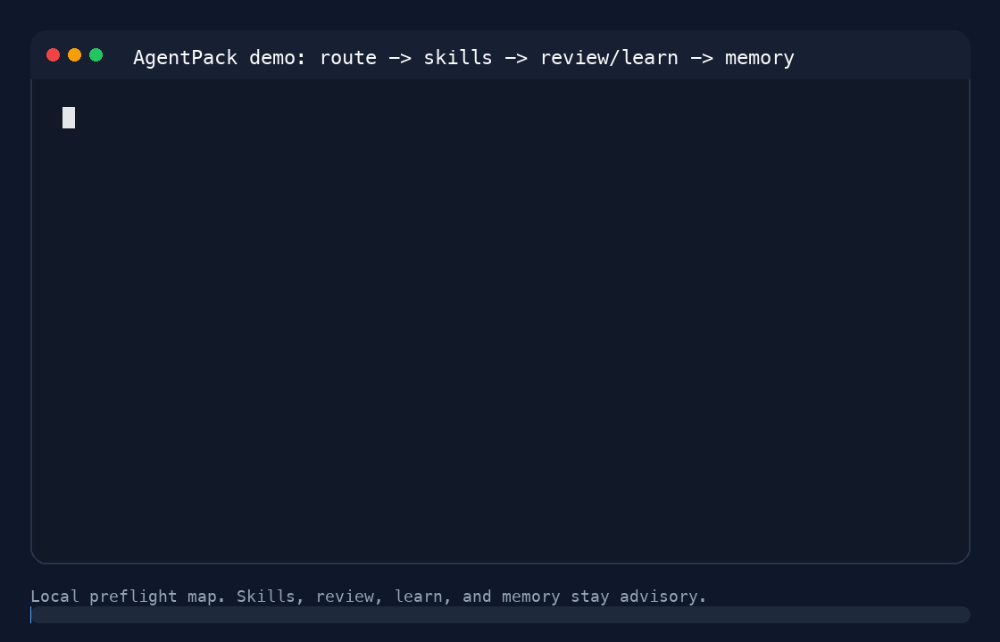

# AgentPack

<p align="center">
  
</p>

<p align="center">
  <strong>Your agent starts cold. AgentPack hands it the map.</strong>
</p>

<p align="center">
  <em>Ranked repo context for Codex, Claude Code, Cursor, Windsurf, Copilot, Cline, Kiro, OpenCode, MCP, CI, and markdown workflows.</em>
</p>

<p align="center">
  <a href="https://deepwiki.com/vishal2612200/agentpack"></a>
  <a href="https://pypi.org/project/agentpack-cli/"></a>
  <a href="https://pepy.tech/projects/agentpack-cli"></a>
  <a href="https://www.npmjs.com/package/@vishal2612200/agentpack"></a>
  <a href="https://www.npmjs.com/package/@vishal2612200/agentpack"></a>
  <a href="https://hol.org/registry/plugins/agentpack%2Fagentpack"></a>
  <a href="https://hol.org/registry/plugins/agentpack%2Fagentpack"></a>
  <a href="https://github.com/vishal2612200/agentpack/actions/workflows/ci.yml"></a>
  <a href="https://opensource.org/licenses/MIT"></a>
</p>

<p align="center">
  <code>local preflight</code>
  <code>ranked files</code>
  <code>skill routing</code>
  <code>warm cache</code>
  <code>tests + commands</code>
  <code>receipts</code>
  <code>no cloud index</code>
</p>

---

<p align="center">
  
</p>

<p align="center">
  <a href="docs/assets/agentpack-demo.mp4">MP4 demo</a>
</p>

You know the pattern. You ask an agent to fix one bug. It `rg`s half the repo, opens the wrong files, misses the test, then rediscovers the architecture you already had.

AgentPack does the repo-orientation pass first.

```text
agentpack route --task "fix auth token expiry"
-> files that probably matter
-> why those files, and why common candidates were skipped
-> skills and rules that fit the task
-> tests that probably prove it
-> rules, commands, warnings
-> compact context before the agent edits
```

AgentPack is not another coding agent. It is the local context engine you put in front of the agents you already use.

## The Pitch

```text
Without AgentPack: agent explores first, edits later.
With AgentPack:    agent starts near the right files.
```

No cloud index. No embeddings. No model calls for scan/rank/pack. Just local repo analysis, ranked context, and receipts for what got included or skipped.

It is not a repo dump. It is not a second brain. It is not a promise that your agent will be right.

It is a preflight map: likely files, likely tests, the right local skill or rule, commands, warnings, and a compact pack your agent can inspect before touching code.

The first run builds local summaries and repo signals. Later runs reuse that cache, so agents do less repeat discovery and spend more of their budget on the actual change.

## Quick Start

```bash
pipx install agentpack-cli
agentpack --version
```

Inside your repo:

```bash
agentpack init --yes
agentpack start "fix auth token expiry"
agentpack next
agentpack doctor --agent auto
```

Then give `.agentpack/context.md` to your agent, or let MCP-capable agents call AgentPack tools directly.
Core onboarding is `quickstart`, `start`, `next`, and `doctor`. Use `route`,
`pack`, and `benchmark` when you need deeper inspection or measurement.
Everything else is an advanced workflow or release/diagnostic helper.

For one-shot use without installing:

```bash
pipx run --spec agentpack-cli agentpack route --task "fix auth token expiry"
```

For JavaScript/TypeScript projects, npm wrapper is available:

```bash
npx @vishal2612200/agentpack --version
npx @vishal2612200/agentpack init --yes
npx @vishal2612200/agentpack task set "fix auth token expiry"
npx @vishal2612200/agentpack pack --task auto
```

## New Contributors

Start with [`good first issue`](https://github.com/vishal2612200/agentpack/issues?q=is%3Aissue%20is%3Aopen%20label%3A%22good%20first%20issue%22) or [`help wanted`](https://github.com/vishal2612200/agentpack/issues?q=is%3Aissue%20is%3Aopen%20label%3A%22help%20wanted%22) issues.
If this would be your first open-source contribution, use the smaller
[`first-timers-only`](https://github.com/vishal2612200/agentpack/issues?q=is%3Aissue%20is%3Aopen%20label%3A%22first-timers-only%22) queue.
Contribution setup and review expectations are in [CONTRIBUTING.md](CONTRIBUTING.md).

## Quick Demo

Route task first:

```bash
agentpack route --task "fix billing webhook retry handling"
```

AgentPack returns likely files, why-selected and why-not-selected notes, tests, rules, commands, and warnings without changing source files.
It also recommends matching skills or agent rules when the task points at a known workflow, framework, language, or repo convention.

Build context pack next:

```bash
agentpack task set "fix billing webhook retry handling"
agentpack pack --task auto
```

AgentPack writes local context under `.agentpack/`, including selected files, omitted-file receipts, freshness checks, token stats, and `.agentpack/citations.json` source provenance for the packed claims.
It reuses cached file summaries and snapshot metadata so repeated packs do not start from zero.
Run `agentpack doctor` when an agent integration, MCP setup, hook, or installed CLI path looks stale.

## What AgentPack Gives Your Agent

- ranked files for current task
- skill and rule routing for current task
- likely tests and commands
- repo rules and agent instructions
- compact context pack under budget
- curated broad repo context for review/share/audit tasks without a separate bundle command
- citation-backed provenance for packed claims and review artifacts
- review preflight and staged review prompts for file-grounded PR review
- local memory, evaluation, and runtime/performance diagnostics for repeat workflows
- cached summaries for faster repeated orientation
- omitted-file receipts for review
- freshness warnings when task or git state changes
- local benchmark data when selected context misses real changed files

## What's Current In 0.3.35

- First-run output is clearer: `quickstart`, `next`, and top-level help now point new users through one core path before optional diagnostics.
- `doctor`, `repair`, `guard`, and `review --check` now print more explicit failure, impact, repair command, and safe-to-continue guidance.
- Review inline posting is safer: live GitHub comments require a matching `--dry-run-post` payload hash before `--post-inline-comments`.
- MCP structured outputs and TOON validation are stricter, including canonical TOON output for agents that need repairable structured responses.
- Route output now explains both why files were selected and why common candidates were omitted.
- Codex, Claude, Cursor, Windsurf, and Antigravity detection and distributed guidance were refreshed so active-agent and fallback behavior are easier to audit.

## Proof So Far

AgentPack's current public benchmark checks one narrow thing: whether selected context overlaps with files actually changed in historical commits. Treat it as evidence for a ranked starting map, not proof that any agent will finish every task faster or better.

Current scoped result:

| Signal | Result | Developer meaning |
|---|---:|---|
| Public commit cases | 107 | real historical file-selection checks |
| Average recall | 65.7% | did AgentPack include files that mattered? |
| Token precision | 51.4% | how much of pack was useful instead of noise? |
| Pack p50 | 315 tokens | typical compact starting context |
| Pack p95 | 1,137 tokens | larger but still bounded starting context |

Source: [`benchmarks/results/2026-06-25-public.md`](benchmarks/results/2026-06-25-public.md). Benchmark guide: [`docs/benchmarking.md`](docs/benchmarking.md).

This is useful but not magic. It says AgentPack often gets meaningful files into a small pack. It does not replace source inspection, tests, runtime evidence, or review. Agent success A/B benchmarks should report task success, tool calls, token cost, validation quality, and time-to-first-correct-file.

E2E outcome proof is tracked separately in [`benchmarks/results/e2e-ab-status.md`](benchmarks/results/e2e-ab-status.md). Do not treat file-selection results as task-success or cost-savings proof.

## What We Want To Prove Next

AgentPack should eventually show:

- fewer agent file reads
- fewer tool calls
- faster first correct file
- lower total context cost
- equal or better task success

## Works With

- Codex
- Claude Code
- Cursor
- Windsurf
- Antigravity
- MCP tools
- CI and PR review workflows
- generic markdown-based LLM workflows

See [`docs/integrations.md`](docs/integrations.md) and [`docs/mcp-context-engine.md`](docs/mcp-context-engine.md).

### Agent And IDE Plugins

AgentPack can be used through thin plugin and IDE integration layers so agents start with ranked repo context. Codex has a packaged plugin skeleton; Cursor, Windsurf, Copilot, Cline, Kiro, OpenCode, Claude Code, Antigravity, and generic agents use the same local CLI/MCP engine through portable rules, hooks, and native integration stubs.

Inside Codex:

```text
@agentpack-route fix auth token expiry
@agentpack-pack fix auth token expiry
@agentpack-review focus on backward compatibility
```

The Codex plugin calls the local AgentPack engine. Codex setup enables the
local `agentpack@local` bundle so commands like `@agentpack-review` match the
installed CLI version. Verify with `agentpack doctor --agent codex` after
upgrades.

The review flow prepares a local two-stage PR review bundle: preflight metadata,
a runbook, stage prompts, and branch-scoped understanding/findings JSON files.
It does not replace `gh pr view`, `git diff`, direct code reads, or tests.

AgentPack does not upload code and does not turn AgentPack into a coding agent.

See [`docs/agent-plugins.md`](docs/agent-plugins.md) and [`docs/codex-plugin.md`](docs/codex-plugin.md).

## How AgentPack Compares

| Tool type | What it does | AgentPack difference |
|---|---|---|
| Repo dumpers | Dump selected or all files | AgentPack ranks files by task |
| Coding agents | Edit code | AgentPack prepares context before editing |
| IDE search | Finds files on demand | AgentPack pre-routes before agent starts |
| Skills/rules | Change agent behavior | AgentPack routes the matching skill or rule for the task |
| Cache warmers | Speed repeated scans | AgentPack reuses summaries and snapshots inside the context workflow |

## When To Use It

Use AgentPack when:

- repo is large or split across multiple packages
- monorepo structure makes file discovery expensive
- agents repeat same discovery work across tasks
- CI or PR review needs reproducible context
- agents waste tool calls opening irrelevant files
- tasks often miss tests, config, generated rules, or repo conventions
- teams have useful skills/rules but agents do not reliably pick the right one
- repeated agent sessions keep rediscovering the same repo structure

Do not use AgentPack when:

- repo is tiny
- question is one-shot and read-only
- you already know exact files to edit
- you need autonomous coding, not context preparation
- native IDE search is already enough for task

## How It Works

AgentPack scans repo locally, builds and reuses file summaries, indexes local skills and rules, combines filename, git, config, dependency, summary, memory, and benchmark signals, ranks likely files for task, then renders a compact context pack. Review/share/audit tasks also get broad module summaries and inventory receipts in the same artifact.

It can expose the same workflow through CLI, markdown files, MCP tools, hooks, plugins, and CI.

Deep dive: [`docs/architecture.md`](docs/architecture.md), [`docs/how-agentpack-works.md`](docs/how-agentpack-works.md), and [`docs/commands.md`](docs/commands.md).

## Trust And Privacy

- local-first by default
- no cloud indexing
- no embeddings or API calls for scan, rank, pack, stats, or benchmark
- generated files live under `.agentpack/`
- review packs before sharing them outside your machine

Details: [`docs/privacy.md`](docs/privacy.md), [`docs/threat-model.md`](docs/threat-model.md), [`docs/data-flow.md`](docs/data-flow.md), and [`SECURITY.md`](SECURITY.md).

## Install Notes

Requires Python 3.10+ and is tested on Python 3.10-3.14. PyPI package is `agentpack-cli`; command is `agentpack`.

Use `pipx` for normal installs because many macOS/Linux Python distributions block global `pip install` with PEP 668's `externally-managed-environment` error.

Install `pipx` first if needed:

```bash
# macOS
brew install pipx

# Ubuntu/Debian
sudo apt install pipx

# Fedora
sudo dnf install pipx

# Arch
sudo pacman -S python-pipx

pipx ensurepath
```

## Docs

- [`docs/index.md`](docs/index.md): docs home
- [`docs/architecture.md`](docs/architecture.md): pipeline, data flow, package layout, and rendered-budget accounting
- [`docs/commands.md`](docs/commands.md): full CLI command reference
- [`docs/configuration.md`](docs/configuration.md): config, scoring weights, `.agentignore`, and git integration
- [`docs/integrations.md`](docs/integrations.md): agent setup, MCP workflow, hooks, and native integration status
- [`docs/agent-plugins.md`](docs/agent-plugins.md): plugin and IDE distribution layer
- [`docs/codex-plugin.md`](docs/codex-plugin.md): thin Codex plugin commands and local workflow
- [`docs/mcp-context-engine.md`](docs/mcp-context-engine.md): MCP tools and context workflow
- [`docs/benchmarking.md`](docs/benchmarking.md): quality bar, release gate, and public artifacts
- [`docs/limitations.md`](docs/limitations.md): project scope, known limits, and roadmap

## Status

Alpha: `0.3.35`.

Works, tested, and used in real sessions. Python and JavaScript/TypeScript have strongest support. APIs may change before 1.0.

Platform support targets macOS, Linux, and Windows PowerShell with Git for Windows. `cmd.exe` and bare Git setups are not supported yet.

Name note: PyPI package is `agentpack-cli`, npm package is `@vishal2612200/agentpack`, and command is `agentpack`. This project is unrelated to AgentPack dataset papers or other repos with the same name.

## Contributing

See [`CONTRIBUTING.md`](CONTRIBUTING.md) for setup, validation, and PR expectations.
Community behavior is covered by [`CODE_OF_CONDUCT.md`](CODE_OF_CONDUCT.md).

## License

MIT
