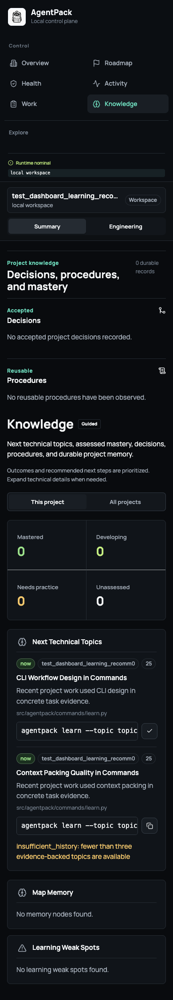

# Dashboard v2 API

Dashboard v2 is the typed project workspace contract used by the local
dashboard. The primary hierarchy is `Project -> Outcomes -> Initiatives ->
Tasks -> Evidence`. Existing snapshot, graph, map, terminal, and action routes
remain available for compatibility.

The stable primary views are **Overview**, **Roadmap**, **Work**, **Health**,
and **Knowledge**. Activity remains available from Overview and the command
palette. Repository, operations, connection, and diagnostic tools are grouped
under Explore so the project decision remains the first surface.

The canonical response schema is
[`docs/schemas/dashboard-v2.schema.json`](schemas/dashboard-v2.schema.json).
The server validates its payloads through the Python models in
`src/agentpack/dashboard/contracts.py`; clients should treat unknown optional
fields as forward-compatible.

Engineering Atlas portfolio is exposed at `GET /api/dashboard/v2/portfolio`.
It reads global index rows and bounded local status caches, groups linked
worktrees by canonical project identity, and returns bounded project,
relation, attention, and activity collections. Use `POST
/api/dashboard/v2/portfolio/github/refresh` for explicit read-only GitHub
evidence refresh. Normal portfolio reads do not invoke GitHub.

## Workspace experience




## Endpoints

All endpoints are loopback-only by default and require the dashboard token in
`X-AgentPack-Token`.

| Method | Path | Purpose |
|---|---|---|
| `GET` | `/api/dashboard/v2?detail=home\|full` | Workspace envelope, task, graph/map data, agent state, and impact summary |
| `GET` | `/api/dashboard/v2/portfolio` | Local-first Engineering Atlas portfolio envelope |
| `POST` | `/api/dashboard/v2/portfolio/github/refresh` | Explicit bounded GitHub evidence refresh |
| `GET` | `/api/dashboard/v2/impact?query=&relationship=&language=&confidence=&limit=200` | Bounded Tree-sitter impact entities, relationships, evidence, and affected tests |
| `GET` | `/api/dashboard/v2/evidence` | Context, selected files, task map, observer, and timeline evidence |
| `GET` | `/api/dashboard/v2/actions` | Suggested actions and the typed action catalog |
| `POST` | `/api/dashboard/v2/actions/inspect` | Explain an action before execution |
| `POST` | `/api/dashboard/v2/actions/run` | Run an approved action through the existing PTY runner |
| `GET` | `/api/dashboard/v2/agents` | Public handoffs and detected agent sessions |
| `GET` | `/api/learning/profile` | Private global learner role and target level |
| `POST` | `/api/learning/profile` | Authenticated learner profile update with a mutation ID |
| `GET` | `/api/learning/recommendations?scope=local\|global` | Read-only schema-v2 queue, profile, and seven competency summaries; dashboard reads do not record recommendation impressions |
| `POST` | `/api/learning/sessions/start` | Start a project-owned session and return its question, evidence, and host coaching prompt |
| `POST` | `/api/learning/sessions/complete` | Validate and record structured host-evaluated proof; canonical retries are idempotent |
| `GET` | `/api/project/overview?workspace=all\|current\|ID` | Profile, roadmap, initiatives, risks, decisions, health, metrics, worktrees, and recent changes |
| `GET` | `/api/project/timeline?workspace=...&kind=...&limit=50` | Unified project activity; `limit` is capped at 200 |
| `GET` | `/api/project/brief?mode=summary\|engineering` | Deterministic redacted Markdown; no repository file is written |
| `POST` | `/api/project/profile` | Revisioned, idempotent shared profile and roadmap update |
| `POST` | `/api/project/events` | Idempotent local outcome, milestone, risk, decision, or initiative event |
| `POST` | `/api/dashboard/v2/agents/resume` | Resume a named handoff |
| `POST` | `/api/dashboard/v2/agents/release` | Release a claimed handoff |

## Project contract

The selected worktree's `.agentpack/config.toml` is authoritative for shared
profile, outcome, and milestone definitions. Project reads discover up to 20
worktrees through Git's common directory and aggregate bounded local artifacts.
Malformed or inaccessible worktrees are skipped with warnings and
`partial=true`; AgentPack never scans unrelated source trees.

Every derived project record carries `source`, `confidence`, `updated_at`,
bounded `evidence`, `workspace_id`, and `warnings`. Missing validation,
architecture, release, context, or knowledge evidence remains `unknown`.
Delivery progress comes only from declared milestones.

The Knowledge view uses the same learning service as CLI and MCP. It shows the
global role/level profile, all seven competencies, the `now`, `weak_spot`, and
`breadth` queue, and an active session. Start and completion reject unregistered,
inaccessible, or read-only owning projects before appending a session row. The
browser refreshes recommendation and competency state when focus returns after
host-agent coaching.

Profile writes require both a unique `mutation_id` and the current 64-character
`expected_revision`. The revision is the SHA-256 hash of the config contents.
Duplicate mutation retries return their prior result; stale revisions return
`409` without changing the file. Dynamic project state is appended as
`project_*` rows in the existing session-event log and folded at read time.

The Overview, Roadmap, Health, and Activity views support `all`, `current`, or a
specific workspace ID. Mutating operations remain scoped to the current
worktree. Summary and Engineering briefs are capped at 20 KB and run through
the existing redactor. Summary omits absolute paths and raw commands;
Engineering may include relative paths, branches, SHAs, and check details.

## Action inspection

Inspection uses the same action builder and terminal policy as v1. The response
is deliberately explicit so a UI or agent can show the intended effect before
running it:

```json
{
  "inspection": {
    "schema_version": 2,
    "action": "refresh_context",
    "command": "agentpack guard --agent codex --refresh-context --thread global",
    "cwd": "/workspace/project",
    "purpose": "Refresh the task-scoped context.",
    "risk": "low",
    "risk_reasons": [],
    "affected_paths": ["src/auth.py"],
    "expected_effect": "Refresh the task-scoped context and update selected-file evidence.",
    "confirm_required": false,
    "allowed": true
  }
}
```

Medium and high-risk actions must be confirmed by the caller. Execution remains
available through the existing terminal and MCP paths; v2 does not create a
second command runner.

Action requests reject unknown fields and require a non-empty `action`. The
same request contract is used for inspection and execution:

```json
{
  "action": "dev_check",
  "target": "src/auth.py",
  "confirmed": false
}
```

Successful execution returns `schema_version`, the terminal `session`, and the
exact `command`. Resume and release accept only a memorable handoff name:

```json
{ "name": "auth-session-retry" }
```

The agents response contains detected provider sessions, active AgentPack
threads, integration health, and public handoff fields. Internal handoff UUIDs
are never included.

## Impact scene

`/impact` returns the existing summary plus stable `entities`,
`relationships`, `affected_tests`, and `scene` fields. Entity IDs use
`file:<path>`, `semantic:<entity-key>`, and `action:<action-id>`; relationship
IDs use `relationship:<edge-key>`. The same identifiers drive 3D, semantic
graph, table, and inspector selection. `scene.available=false` includes an
`unavailable_reason`, and clients retain loaded workspace data and use the
table fallback.

## Errors and unavailable states

All v2 failures use the `errorResponse` schema with `schema_version`, `error`,
stable `kind`, `retryable`, and optional `detail` fields.

| Status | Meaning | Common kinds |
|---|---|---|
| `400` | Malformed JSON, unknown fields, missing values, or invalid action | `malformed_json`, `invalid_request`, `invalid_action` |
| `401` | Missing or invalid dashboard token | `unauthorized` |
| `403` | Read-only project, provider/session restriction, or denied operation | `permission_denied` |
| `409` | Config revision, confirmation, claim, stale-state, or repository conflict | `config_conflict`, `action_conflict`, `handoff_conflict`, `stale_handoff`, `repository_mismatch` |
| `500` | Unexpected local server failure | `server_error` |

Tree-sitter, MCP, and scene availability are represented inside successful
responses so the workspace remains usable. The shared state surface maps stale
context, unavailable capabilities, permission failures, repository mismatch,
conflict, WebGL fallback, and retryable server errors to a concrete recovery
action without clearing previously loaded data.

## Compatibility and migration

Existing `/api/dashboard`, `/api/graph`, `/api/map`, `/api/action/run`, and
terminal endpoints are unchanged. Migrate consumers incrementally by reading
the v2 workspace envelope first, then using `/impact` for symbol-level
navigation and `/actions/inspect` before `/actions/run`. The dashboard stores
the global Summary/Engineering preference locally as
`agentpack.dashboard.presentation_mode`. Stored values remain `explain` or
`build` for compatibility.

The top-bar search control opens a keyboard command palette with `Cmd+K` or
`Ctrl+K`. It indexes loaded project evidence immediately and requests bounded
repository evidence lazily. Palette actions are fixed, parameterless AgentPack
actions and always pass through the existing inspection and confirmation flow.
Queries, task text, command strings, and result content are never persisted;
only eight result IDs per project may be stored as recents.

The home payload includes independent API, snapshot, Context, and MCP evidence
instead of a composite runtime claim. It may also include
`cached_project_status`, a server-produced, secret-redacted project summary
that excludes absolute paths, task and memory content, commands, graphs,
terminal history, and action history. The browser retains one compatible
snapshot for up to seven days. Last-known mode is read-only: navigation and
cached project-evidence search remain available, while mutations, checks,
actions, brief generation, and project switching are disabled.

When Tree-sitter, MCP, WebGL, or an optional artifact is unavailable, v2 keeps
the already-loaded envelope and reports an unavailable or stale state. Clients
should offer the 2D graph/table fallback and a retry or terminal action instead
of treating the condition as an empty repository.

TypeScript consumers import generated definitions from
`frontend/dashboard/src/data/dashboard-v2.generated.ts`. Run
`npm run generate:contracts` after changing the schema and
`npm run check:contracts` in CI to reject drift.
