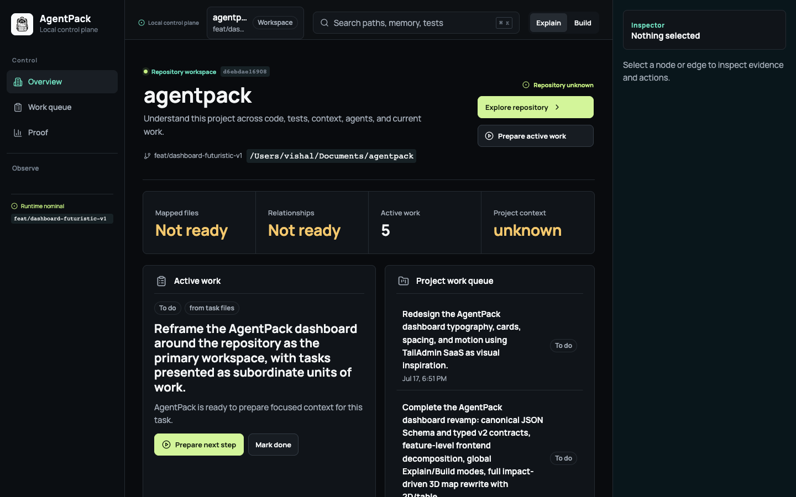
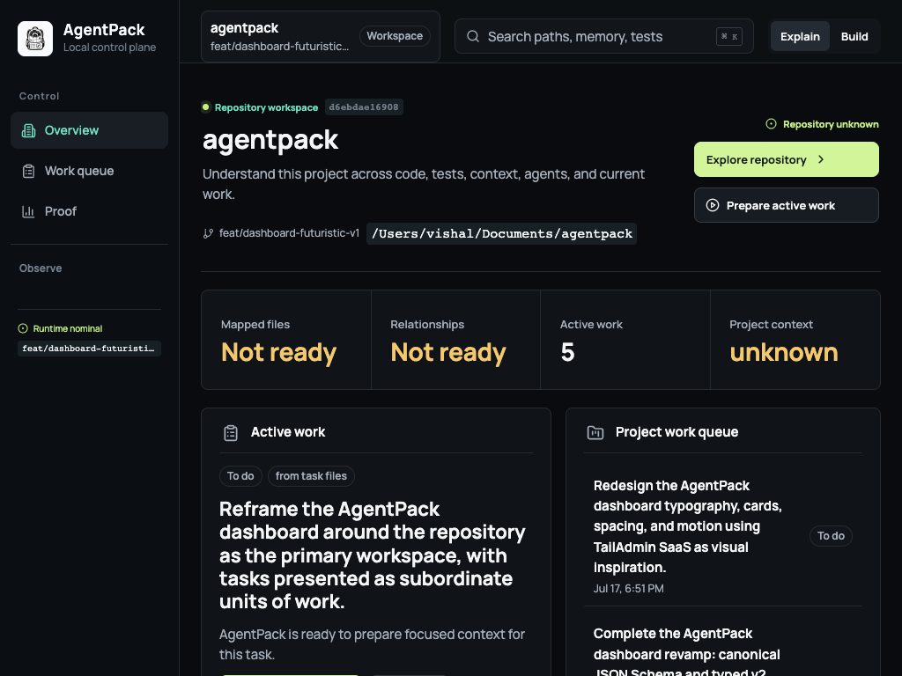

# Dashboard v2 API

Dashboard v2 is the typed workspace contract used by the local dashboard. It
keeps the v1 snapshot, graph, map, terminal, and action routes available while
adding task-aware impact, evidence-backed actions, and agent-session continuity.

The canonical response schema is
[`docs/schemas/dashboard-v2.schema.json`](schemas/dashboard-v2.schema.json).
The server validates its payloads through the Python models in
`src/agentpack/dashboard/contracts.py`; clients should treat unknown optional
fields as forward-compatible.

## Workspace experience





## Endpoints

All endpoints are loopback-only by default and require the dashboard token in
`X-AgentPack-Token`.

| Method | Path | Purpose |
|---|---|---|
| `GET` | `/api/dashboard/v2?detail=home\|full` | Workspace envelope, task, graph/map data, agent state, and impact summary |
| `GET` | `/api/dashboard/v2/impact?query=&relationship=&language=&confidence=&limit=200` | Bounded Tree-sitter impact entities, relationships, evidence, and affected tests |
| `GET` | `/api/dashboard/v2/evidence` | Context, selected files, task map, observer, and timeline evidence |
| `GET` | `/api/dashboard/v2/actions` | Suggested actions and the typed action catalog |
| `POST` | `/api/dashboard/v2/actions/inspect` | Explain an action before execution |
| `POST` | `/api/dashboard/v2/actions/run` | Run an approved action through the existing PTY runner |
| `GET` | `/api/dashboard/v2/agents` | Public handoffs and detected agent sessions |
| `POST` | `/api/dashboard/v2/agents/resume` | Resume a named handoff |
| `POST` | `/api/dashboard/v2/agents/release` | Release a claimed handoff |

## Action inspection

Inspection uses the same action builder and terminal policy as v1. The response
is deliberately explicit so a UI or agent can show the intended effect before
running it:

```json
{
  "inspection": {
    "schema_version": 2,
    "action": "refresh_context",
    "command": "agentpack guard --agent codex --refresh-context --thread global",
    "cwd": "/workspace/project",
    "purpose": "Refresh the task-scoped context.",
    "risk": "low",
    "risk_reasons": [],
    "affected_paths": ["src/auth.py"],
    "expected_effect": "Refresh the task-scoped context and update selected-file evidence.",
    "confirm_required": false,
    "allowed": true
  }
}
```

Medium and high-risk actions must be confirmed by the caller. Execution remains
available through the existing terminal and MCP paths; v2 does not create a
second command runner.

Action requests reject unknown fields and require a non-empty `action`. The
same request contract is used for inspection and execution:

```json
{
  "action": "dev_check",
  "target": "src/auth.py",
  "confirmed": false
}
```

Successful execution returns `schema_version`, the terminal `session`, and the
exact `command`. Resume and release accept only a memorable handoff name:

```json
{ "name": "auth-session-retry" }
```

The agents response contains detected provider sessions, active AgentPack
threads, integration health, and public handoff fields. Internal handoff UUIDs
are never included.

## Impact scene

`/impact` returns the existing summary plus stable `entities`,
`relationships`, `affected_tests`, and `scene` fields. Entity IDs use
`file:<path>`, `semantic:<entity-key>`, and `action:<action-id>`; relationship
IDs use `relationship:<edge-key>`. The same identifiers drive 3D, semantic
graph, table, and inspector selection. `scene.available=false` includes an
`unavailable_reason`, and clients retain loaded workspace data and use the
table fallback.

## Errors and unavailable states

All v2 failures use the `errorResponse` schema with `schema_version`, `error`,
stable `kind`, `retryable`, and optional `detail` fields.

| Status | Meaning | Common kinds |
|---|---|---|
| `400` | Malformed JSON, unknown fields, missing values, or invalid action | `malformed_json`, `invalid_request`, `invalid_action` |
| `401` | Missing or invalid dashboard token | `unauthorized` |
| `403` | Provider/session restriction or denied operation | `permission_denied` |
| `409` | Confirmation, claim, stale-state, or repository conflict | `action_conflict`, `handoff_conflict`, `stale_handoff`, `repository_mismatch` |
| `500` | Unexpected local server failure | `server_error` |

Tree-sitter, MCP, and scene availability are represented inside successful
responses so the workspace remains usable. The shared state surface maps stale
context, unavailable capabilities, permission failures, repository mismatch,
conflict, WebGL fallback, and retryable server errors to a concrete recovery
action without clearing previously loaded data.

## Compatibility and migration

Existing `/api/dashboard`, `/api/graph`, `/api/map`, `/api/action/run`, and
terminal endpoints are unchanged. Migrate consumers incrementally by reading
the v2 workspace envelope first, then using `/impact` for symbol-level
navigation and `/actions/inspect` before `/actions/run`. The dashboard stores
the global presentation preference locally as
`agentpack.dashboard.presentation_mode` with values `explain` or `build`.

When Tree-sitter, MCP, WebGL, or an optional artifact is unavailable, v2 keeps
the already-loaded envelope and reports an unavailable or stale state. Clients
should offer the 2D graph/table fallback and a retry or terminal action instead
of treating the condition as an empty repository.

TypeScript consumers import generated definitions from
`frontend/dashboard/src/data/dashboard-v2.generated.ts`. Run
`npm run generate:contracts` after changing the schema and
`npm run check:contracts` in CI to reject drift.
